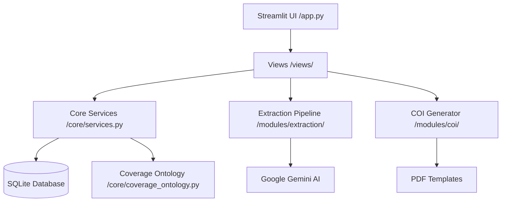

# 📖 Insurance Policy Intelligence Hub - Master Documentation

Welcome to the comprehensive technical and operational manual for the **Insurance Policy Intelligence Hub**. This document serves as the single source of truth for the system's architecture, data flows, core logic, and maintenance procedures.

---

## 📑 Table of Contents

1. [Architecture Deep Dive](#1-architecture-deep-dive)
2. [Extraction Pipeline (Universal Scout)](#2-extraction-pipeline-universal-scout)
3. [Coverage Ontology & Validation](#3-coverage-ontology--validation)
4. [API & Module Reference](#4-api--module-reference)
5. [Setup & Operations](#5-setup--operations)
6. [Data Flow & Communication](#6-data-flow--communication)
7. [UI & View Reference](#7-ui--view-reference)
8. [Utility & Helper Modules](#8-utility--helper-modules)
9. [COI Generation & Mapping](#9-coi-generation--mapping)
10. [Troubleshooting & FAQ](#10-troubleshooting--faq)
11. [Development Utilities](#11-development-utilities)
12. [Directory Map](#12-directory-map)

---

## 1. Architecture Deep Dive

The project follows a **Modified Layered Architecture**, designed for modularity, testability, and scalability.

### 1.1 High-Level Design

The system is divided into four primary layers:

- **Presentation Layer**: Streamlit-based UI (`app.py` and `views/`).
- **Service Layer**: Business logic and "glue" (`core/services.py`).
- **Intelligence Layer**: The AI-powered extraction pipeline (`modules/extraction/`).
- **Persistence Layer**: SQLAlchemy-managed SQLite database (`core/database.py`).



### 1.2 Design Philosophy

- **Ontology-Driven**: The database schema and extraction schemas are derived from the `COVERAGE_REGISTRY` in `core/coverage_ontology.py`.
- **Stateless Extraction**: The extraction pipeline does not store state; it takes a PDF and returns normalized JSON. Persistence is handled by the Service layer.
- **Fail-Soft**: Each extraction step is wrapped in safety boundaries. If vehicle extraction fails, the policy and coverage extraction can still succeed.

---

## 2. Extraction Pipeline (Reliability Architecture v2)

The system uses a bi-modal, self-correcting pipeline powered by Google Gemini (2.5 Flash). It prioritizes **Speed** for small documents and **Reliability** for complex ones.

### 2.1 Mode A: Turbo Mode (Speed)

**Trigger**: Documents ≤ 5 pages.

- **Logic**: Skips the expensive "Mapping Phase" entirely.
- **Process**: `Upload -> Classify -> Parallel Extraction (Full Doc)`.
- **Benefit**: Reduces processing time by ~40% for certificates, ID cards, and simple policies.

### 2.2 Mode B: The Cartographer (Precision)

**Trigger**: Documents > 5 pages.

- **Logic**: Replaces the old 2-step (Locator + Scout) with a unified "Cartographer" step.
- **Process**:
  1.  **Cartographer**: Scans the full document ONCE to identify:
      - **Sections**: Declarations, Coverages, Vehicles, Drivers.
      - **Signals**: Premium tables, Vehicle schedules, Driver lists.
  2.  **Smart Slicing**: Creates optimized PDF slices (Page ranges +/- 1) based on Cartographer findings.
  3.  **Parallel Extraction**: Sends only the relevant pages to the extractors.

### 2.3 Tiered Verification (The Auditor)

A "Fail-Fast" quality gate that runs after extraction.

- **Tier 1 (Instant)**: Python-based guardrails check for:
  - Null Policy Numbers
  - Missing Effective Dates
  - Logical Inconsistencies (e.g., Auto Policy without Liability)
- **Tier 2 (Repair Loop)**:
  - If Tier 1 fails, the system **automatically triggers a targeted repair call**.
  - Components: `auditor.py` generates a surgical prompt ("You missed the Policy Number on Page 1. Fix it.")
  - **Result**: Self-healing extraction that fixes errors without user intervention.

### 2.4 Carrier Knowledge Base

- **File**: `modules/extraction/knowledge_base.py`
- **Function**: Injects carrier-specific hints (e.g., "GEICO puts drivers on the last page") into the prompt if the carrier is detected.

---

## 3. Coverage Ontology & Validation

The `core/coverage_ontology.py` is the "Rulebook" of the entire system.

### 3.1 The Registry (`COVERAGE_REGISTRY`)

Every coverage the system can find must exist here. It defines:

- **`family`**: e.g., `auto_liability`, `general_liability`.
- **`limit_structure`**: e.g., `csl`, `split`, `per_occurrence`.
- **`allowed_limits`**: Specifies which keys (e.g., `per_person`) are valid for that code.

### 3.2 Strict Validation Logic

The `validate_coverage()` function ensures adherence to the registry:

1. **Family Parity**: Rejects if the AI maps a coverage to the wrong family.
2. **Structure Check**: Rejects if a split limit is provided for a CSL code.
3. **Key Enforcement**: Strips any limit keys that aren't explicitly allowed in the registry for that code.

---

## 4. API & Module Reference

### 4.1 `PolicyService` (Core Service)

- `save_policy_from_extraction(result)`: Maps raw AI JSON to SQLAlchemy relationships.
- `create_policy_from_dict(data)`: **[NEW]** Centralized factory method for constructing `Policy` objects from dictionary payloads (Manual entry or Extraction). Handles nested object creation and date parsing.
- `ask_your_data(query)`: Translates NL to SQL, executes against SQLite, and returns results. **Enhanced** with whitelisted default views and state persistence.

### 4.2 `GeminiExtractionPipeline` (Extraction Module)

- `run(file_bytes)`: The primary orchestrator.
- `_perform_extraction(ctx, processor)`: Manages the parallel threads for specialized extraction.

### 4.3 `UsageService` (Tracking)

- `log_usage(model, tokens)`: Calculates estimated USD cost based on token counts and model pricing.
- `is_over_budget()`: Provides a safety check to prevent runaway API spend.

---

## 5. Setup & Operations

### 5.1 Installation

1. Create a virtual environment: `python -m venv .venv`
2. Install dependencies: `pip install -r requirements.txt`
3. Configure API Key: Create a `.env` file with `GOOGLE_API_KEY=...`

### 5.2 Docker Deployment

The project includes a `Dockerfile` for containerized environments.

- **Build**: `docker build -t insurance-hub .`
- **Run**: `docker run -p 8501:8501 --env-file .env insurance-hub`

### 5.3 Database & Migration Logic

The system uses a custom, lightweight migration bridge in `core/database.py`.

- **Automatic Schema Updates**: On startup, `init_db()` inspects the existing SQLite schema and automatically performs `ALTER TABLE` commands if new columns have been added to the models. This ensures zero-downtime updates for local development.

### 5.4 Cache Management

The system uses a versioned cache in `.cache/extraction_cache/`.

- **To Clear Cache**: Delete the contents of this folder or increment `CACHE_VERSION` in `pipeline.py`.
- **Cache Logic**: Files are hashed; if the same file is uploaded twice with the same `CACHE_VERSION`, the AI is bypassed entirely.

### 5.3 Database Maintenance

The SQLite database `data/insurance_data.db` can be managed using standard SQL tools or the built-in **Database Management** page in the UI.

---

## 6. Data Flow & Communication

### 6.1 NL-to-SQL (Chat with Data)

The system uses a specialized prompt that provides the **full schema** to Gemini.

- **Safety**: Only `SELECT` statements are permitted. Semicolons are stripped.
- **Normalization**: The prompt instructs the AI on how to handle currency strings using SQLite `REPLACE()` and `CAST()`.

---

## 7. UI & View Reference

The frontend is built with **Streamlit** and located in the `views/` directory.

- **`dashboard.py`**: High-level business intelligence. Displays total policies, vehicle counts, and aggregate premiums using metrics cards and charts.
- **`process_policies.py`**: The extraction engine's primary interface. Handles PDF uploads, progress tracking, and intermediate review. **Enhanced** with an editable **Coverage Data Editor**.
- **`database_page.py`**: CRUD interface. **Enhanced UX** featuring compact popover column controls, status icons, and row-selected action buttons.
- **`edit_dialog.py`**: A modal component that allows users to manually correct policy records.
- **`create_coi.py`**: The certificate generation workflow.

---

## 8. Utility & Helper Modules

Located in `utils/`, these modules provide deterministic enhancements to AI output.

- **`vehicle_utils.py` (`refine_vehicle_type`)**: Enhances vehicle classification using weight-based logic (e.g., GVW > 26k = "Tractor").
- **`text_utils.py`**: **[NEW]** Centralized logic for `parse_currency()` and `normalize_string()`, used throughout the service and history layers.
- **`naic_utils.py`**: Fallback dictionary for looking up NAIC codes by Carrier Name.
- **`exporter.py`**: Generates formatted Excel reports from the SQLite policy table.

---

## 9. COI Generation & Mapping

The system generates ACORD 25 certificates using `modules/coi/`.

- **`generator.py`**: Uses the `pypdf` library to perform low-level form-filling. It injects data into the `data/COI Example.pdf` template.
- **`mapping.json`**: Acts as the translation layer. It maps human-friendly keys (e.g., `policy_number`) to the specific, technical Field IDs inside the ACORD PDF form.
- **`COIService.prepare_coi_data()`**: The pre-processing step that aggregates vehicles and drivers into descriptive strings for the "Description of Operations" box.

---

## 10. Troubleshooting & FAQ

### 10.1 "Quota Exceeded" Errors

- **Cause**: The Gemini API has per-minute and per-day token limits.
- **Solution**: Check the `Usage Dashboard` to see if you have hit your limit. Use the `ExtractionCache` to avoid re-processing existing files.

### 10.2 Missing Coverages

- **Cause**: The AI couldn't find a mapping in `COVERAGE_REGISTRY` or the text was too illegible.
- **Solution**: Check `modules/extraction/prompts.py` to ensure the registry is being passed correctly. Review the "Smart Slicing" pages to ensure the relevant text was in the slice.

### 10.3 Limit Parsing Errors

- **Cause**: Formats like "Split Limits" (100/300/50) can sometimes be misinterpreted as CSL.
- **Solution**: The `summarize_auto_liability` function in `core/coverage_ontology.py` is the deterministic source of truth. Check the logic there to see how it resolves conflicts.

---

## 11. Development Utilities

The `scripts/` directory contains tools for debugging and maintenance:

- **`check_models.py`**: A diagnostic script that verifies the database schema and prints current column structures.
- **`inspect_pdf.py`**: A utility for low-level inspection of PDF metadata and page count, useful for debugging slicing issues.

---

## 12. Directory Map

```text
/
├── app.py                # Main Entry Point
├── core/
│   ├── coverage_ontology.py # Registry & Validation
│   ├── database.py       # SQLAlchemy Schemas
│   └── services.py       # Business Services & NL2SQL
├── modules/
│   ├── extraction/       # AI Pipeline (Scout, Slice, Extract)
│   └── coi/              # PDF COI Generation
├── views/                # Streamlit Page modules
├── data/                 # SQLite DB, PDF Templates, Mappings
├── utils/                # Vehicle/NAIC/Text & Export Helpers
│   ├── text_utils.py     # Normalized parsing
│   ├── vehicle_utils.py  # Classification enrichment
│   └── naic_utils.py     # Carrier registry
└── .cache/               # Extraction PDF Cache
```

---

_Document Version: 1.1 (January 2026)_
