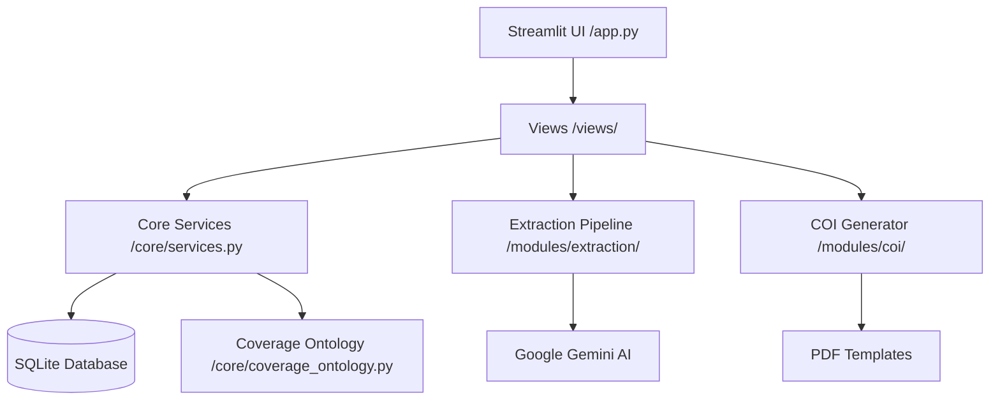

# 📖 Insurance Policy Intelligence Hub - Master Documentation

Welcome to the comprehensive technical and operational manual for the **Insurance Policy Intelligence Hub**. This document serves as the single source of truth for the system's architecture, data flows, core logic, and maintenance procedures.

---

## 📑 Table of Contents

1. [Architecture Deep Dive](#1-architecture-deep-dive)
2. [Extraction Pipeline (Universal Scout)](#2-extraction-pipeline-universal-scout)
3. [Coverage Ontology & Validation](#3-coverage-ontology--validation)
4. [API & Module Reference](#4-api--module-reference)
5. [Setup & Operations](#5-setup--operations)
6. [Data Flow & Communication](#6-data-flow--communication)

---

## 1. Architecture Deep Dive

The project follows a **Modified Layered Architecture**, designed for modularity, testability, and scalability.

### 1.1 High-Level Design

The system is divided into four primary layers:

- **Presentation Layer**: Streamlit-based UI (`app.py` and `views/`).
- **Service Layer**: Business logic and "glue" (`core/services.py`).
- **Intelligence Layer**: The AI-powered extraction pipeline (`modules/extraction/`).
- **Persistence Layer**: SQLAlchemy-managed SQLite database (`core/database.py`).

### 1.2 Design Philosophy

- **Ontology-Driven**: The database schema and extraction schemas are derived from the `COVERAGE_REGISTRY` in `core/coverage_ontology.py`.
- **Stateless Extraction**: The extraction pipeline does not store state; it takes a PDF and returns normalized JSON. Persistence is handled by the Service layer.
- **Fail-Soft**: Each extraction step is wrapped in safety boundaries. If vehicle extraction fails, the policy and coverage extraction can still succeed.

---

## 2. Extraction Pipeline (Universal Scout)

The system uses a sophisticated, multi-stage pipeline powered by Google Gemini (2.0/2.5 Flash) to ensure high precision with minimal token costs.

### 2.1 Phase 0: Universal Scouting

The most critical addition to the v5 pipeline. Instead of guessing where data is, the system performs a full-document "scout" using the `UNIVERSAL_SCOUT_PROMPT`.

- **Purpose**: Identify exact page numbers for Premium, Vehicles, Drivers, and Coverages.
- **Benefit**: Reduces the amount of text sent to the heavy extraction models, drastically improving speed and accuracy.

### 2.2 Phase 2: Smart Slicing

The locator and scout findings are merged to create **Smart Slices**.

- **Logic**: For every page identified by the Scout, we expand the range by **+/- 1 page** to capture context (e.g., if a table spans two pages).
- **Parallelism**: The system then creates 4 separate PDF byte-slices and processes them in parallel using a `ThreadPoolExecutor`.

### 2.3 Phase 4: Assembly & Validation

Raw JSON responses from Gemini are merged into a unified `ExtractionContext`.

- **Unwrapping**: A recursive JSON parser (`_parse_json_response`) handles Gemini's occasional tendency to wrap responses in lists.
- **CSL Supremacy**: Python logic enforces that if a Combined Single Limit (CSL) is found, specific BI/PD splits are ignored to prevent data conflicts.

---

## 3. Coverage Ontology & Validation

The `core/coverage_ontology.py` is the "Rulebook" of the entire system.

### 3.1 The Registry (`COVERAGE_REGISTRY`)

Every coverage the system can find must exist here. It defines:

- **`family`**: e.g., `auto_liability`, `general_liability`.
- **`limit_structure`**: e.g., `csl`, `split`, `per_occurrence`.
- **`allowed_limits`**: Specifies which keys (e.g., `per_person`) are valid for that code.

### 3.2 Strict Validation Logic

The `validate_coverage()` function ensures adherence to the registry:

1. **Family Parity**: Rejects if the AI maps a coverage to the wrong family.
2. **Structure Check**: Rejects if a split limit is provided for a CSL code.
3. **Key Enforcement**: Strips any limit keys that aren't explicitly allowed in the registry for that code.

---

## 4. API & Module Reference

### 4.1 `PolicyService` (Core Service)

- `save_policy_from_extraction(result)`: Maps raw AI JSON to SQLAlchemy relationships.
- `ask_your_data(query)`: Translates NL to SQL, executes against SQLite, and returns results.

### 4.2 `GeminiExtractionPipeline` (Extraction Module)

- `run(file_bytes)`: The primary orchestrator.
- `_perform_extraction(ctx, processor)`: Manages the parallel threads for specialized extraction.

### 4.3 `UsageService` (Tracking)

- `log_usage(model, tokens)`: Calculates estimated USD cost based on token counts and model pricing.
- `is_over_budget()`: Provides a safety check to prevent runaway API spend.

---

## 5. Setup & Operations

### 5.1 Installation

1. Create a virtual environment: `python -m venv .venv`
2. Install dependencies: `pip install -r requirements.txt`
3. Configure API Key: Create a `.env` file with `GOOGLE_API_KEY=...`

### 5.2 Cache Management

The system uses a versioned cache in `.cache/extraction_cache/`.

- **To Clear Cache**: Delete the contents of this folder or increment `CACHE_VERSION` in `pipeline.py`.
- **Cache Logic**: Files are hashed; if the same file is uploaded twice with the same `CACHE_VERSION`, the AI is bypassed entirely.

### 5.3 Database Maintenance

The SQLite database `data/insurance_data.db` can be managed using standard SQL tools or the built-in **Database Management** page in the UI.

---

## 6. Data Flow & Communication

### 6.1 NL-to-SQL (Chat with Data)

The system uses a specialized prompt that provides the **full schema** to Gemini.

- **Safety**: Only `SELECT` statements are permitted. Semicolons are stripped.
- **Normalization**: The prompt instructs the AI on how to handle currency strings using SQLite `REPLACE()` and `CAST()`.

---

_Document Version: 1.0 (January 2026)_
