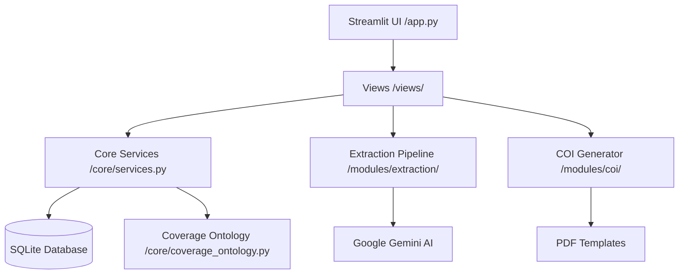

# 📘 Insurance Policy Intelligence Hub - Full Project Guide

This guide provides a comprehensive overview of the **Insurance Policy Intelligence Hub**, detailing its architecture, components, data flows, and core logic.

---

## 1. Project Objective & Philosophy

The system's mission is to transform unstructured insurance PDF documents into structured, actionable data with high precision.

**Core Principles (from `project-rules.md`):**

- **Ontology**: All coverages must map to the `COVERAGE_REGISTRY`. No free-text coverages.
- **Determinism Over Intelligence**: AI extracts raw facts; Python code applies the business logic.
- **Prefer Omission Over Guessing**: Accuracy is prioritized over completeness. Missing data is better than incorrect data.
- **Modular Approach**: Extraction is broken into specialized, section-based steps rather than one massive prompt.

---

## 2. High-Level Architecture

The project follows a modular, layered architecture:



---

## 3. Component Breakdown

### 3.1 Frontend & UI (`app.py`, `views/`)

- **`app.py`**: The entry point. Handles main sidebar navigation, session state (API keys, DB engine), and routing to specialized views.
- **`views/`**: Contains the logic for individual pages:
  - `dashboard.py`: Shows high-level metrics (total policies, premium totals).
  - `process_policies.py`: The "Extraction" interface. Handles file uploads and orchestrates the extraction pipeline.
  - `database_page.py`: Management interface for stored policies. Includes search and deletion.
  - `edit_dialog.py`: A specialized component for manually correcting AI-extracted data before/after saving.
  - `create_coi.py`: Interface for selecting a policy and holder to generate a COI.

### 3.2 Core Logic (`core/`)

- **`database.py`**: Defines the SQLAlchemy models:
  - `Policy`: Main record (dates, carrier, insured info, summarized limits).
  - `Vehicle`: Year, Make, Model, VIN, GVW, Body/Chassis types.
  - `Driver`: Name, License, Excluded status.
  - `Coverage`: Linked to an ontology code, family, and structured limits.
- **`services.py`**: The "Glue" layer.
  - `PolicyService`: Handles saving, updating, and normalizing data. It includes the "Ask Your Data" logic which uses Gemini to convert natural language to SQL.
  - `COIService`: Prepares the data structure needed for COI generation (merging drivers/vehicles into description strings).
- **`coverage_ontology.py`**: The single source of truth for insurance products.
  - `COVERAGE_REGISTRY`: A dictionary mapping codes (e.g., `AUTO_LIAB_BI`) to families, lines of business, and limit structures.
  - `validate_coverage()`: Ensures extracted data matches the registry rules.
  - `summarize_*()`: Deterministic Python logic to calculate "best" limits from a list of coverages.

### 3.3 Extraction Module (`modules/extraction/`)

This is the most complex component, utilizing a multi-phase, parallelized pipeline:

1.  **`pdf_ops.py`**: Handles low-level PDF manipulation (hashing, slicing, counting pages).
2.  **`pipeline.py` (`GeminiExtractionPipeline`)**:
    - **Step 0 (Universal Scouting) [NEW]**: Before slicing, the system runs a fast, full-document scout using `UNIVERSAL_SCOUT_PROMPT`. This identifies specific pages containing **Premium Signals**, **Vehicle Schedules**, **Driver Lists**, and **Coverage Schedules**.
    - **Step 1 (Section Locating)**: Identifies general page ranges for major sections (Declarations, Vehicles, etc.).
    - **Step 2 (Smart Slicing)**: Merges findings from the Scout and the Section Locator. It expands discovered pages by +/- 1 to ensure full context, creating optimized "Smart Slices".
    - **Step 3 (Parallel Extraction)**: Runs 4 parallel Gemini calls (one for each slice) using specialized **Prompts** and **Schemas**.
    - **Step 4 (Assembly)**: Merges the parallel results, applies CSL/Split rules, and validates against the Ontology.
3.  **`prompts.py` / `schemas.py`**: Define the instructions and the strict JSON output format the AI must follow.
4.  **`ExtractionCache`**: A versioned caching system that prevents re-processing identical PDF hashes, saving API costs and time.

### 3.4 Utilities (`utils/`)

- **`naic_utils.py`**: A helper for looking up NAIC codes based on Carrier Names if the AI misses them or they are absent from the document.
- **`vehicle_utils.py`**: Contains deterministic logic (`refine_vehicle_type`) to enrich vehicle data based on GVW (Gross Vehicle Weight) and keywords, helping classify them as "Tractors", "Trailers", or "Straight Trucks".
- **`exporter.py`**: Handles generating Excel reports from the policy database using `pandas`.

### 3.5 COI Module (`modules/coi/`)

- **`generator.py`**: Uses `pypdf` to fill the `data/COI Example.pdf` template.
- **`mapping.json`**: Translates human-readable data keys (e.g., `Insurer_Name_A`) to the specific field IDs in the ACORD PDF form (e.g., `F[0].P1[0].Insurer_FullName_A[0]`).

---

## 4. Communication & Data Flow

### 4.1 From PDF to Database

1.  User uploads `policy.pdf` in `process_policies.py`.
2.  `process_pdf()` starts the pipeline.
3.  **Phase 0**: Universal Scout identifies specific pages for Premium, Vehicles, Drivers, and Coverages.
4.  **Phase 1**: Section Locator identifies general page ranges.
5.  **Phase 2**: **Smart Slicing** merges Scout + Locator results into optimized PDF slices with context (+/- 1 page).
6.  **Phase 3**: Gemini performs **Parallel Extraction** on the slices.
7.  The results are returned to the UI as a "Review Page" for verification.
8.  If approved, `PolicyService.save_policy_from_extraction()` converts the normalized JSON into SQLAlchemy objects and commits them to `insurance_data.db`.

### 4.2 From Database to COI

1.  User selects a Policy ID in `create_coi.py`.
2.  `PolicyService.get_policy_by_id()` retrieves the full record.
3.  `COIService.prepare_coi_data()` formats vehicles/drivers into descriptive strings and gathers carrier info.
4.  `COIGenerator.generate_coi()` fills the PDF template using `mapping.json`.
5.  The user downloads the resulting PDF.

### 4.3 Chat With Data (NL to SQL)

1.  User asks: "Which policies expire next month?"
2.  `PolicyService.ask_your_data()` sends the **Database Schema** + **User Query** to Gemini.
3.  Gemini returns a raw SQL `SELECT` statement.
4.  The Service executes the SQL against SQLite and returns the result table.

---

## 5. Key Methods Reference

| Component      | Class/Module               | Primary Method                  | Purpose                                     |
| :------------- | :------------------------- | :------------------------------ | :------------------------------------------ |
| **Extraction** | `GeminiExtractionPipeline` | `run()`                         | The main 4-step extraction orchestrator.    |
| **Database**   | `PolicyService`            | `save_policy_from_extraction()` | Maps raw AI JSON to DB Relationships.       |
| **Ontology**   | `coverage_ontology.py`     | `validate_coverage()`           | Rejects data that doesn't fit the registry. |
| **COI**        | `COIGenerator`             | `generate_coi()`                | Low-level PDF form filling.                 |
| **Search**     | `PolicyService`            | `ask_your_data()`               | Natural language query interface.           |

---

## 6. Directory Map

```text
/
├── app.py                # Main Entry Point
├── core/
│   ├── coverage_ontology.py # The Rulebook
│   ├── database.py       # SQL Schemas
│   └── services.py       # Business Services
├── modules/
│   ├── extraction/       # AI Pipeline
│   └── coi/              # PDF Generation
├── views/                # Streamlit UI Pages
├── data/                 # PDF Templates & SQLite DB
└── assets/               # CSS, Logos, Icons
```

---

_This guide reflects the current state of the project as of January 2026._
