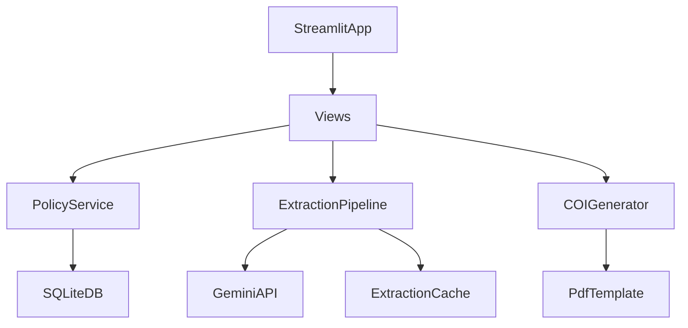

# System Architecture

This document describes the current implemented architecture in this repository.

## High-Level System

- **Primary app:** Streamlit UI entrypoint in `app.py`
- **Data layer:** SQLAlchemy models in `core/database.py` backed by SQLite (`insurance_data.db`)
- **Business/services:** `core/services.py` and `core/history_service.py`
- **Extraction:** Gemini pipeline in `modules/extraction/pipeline.py`
- **COI generation:** `modules/coi/generator.py` with mapping in `modules/coi/mapping.json`

## Runtime Topology

## Backend Layering

### 1) Presentation Layer
- `app.py` handles app bootstrapping, sidebar navigation, settings dialog, and page routing.
- `views/` contains page-level interaction logic:
  - `dashboard.py`
  - `process_policies.py`
  - `database_page.py`
  - `create_coi.py`

### 2) Service Layer
- `PolicyService` in `core/services.py`
  - policy CRUD/search
  - extraction persistence and duplicate update logic
  - dashboard/statistics queries
  - natural language SQL helper (`ask_your_data`)
- `UsageService`
  - usage logging and daily budget checks
- `COIService`
  - preparation helpers for COI payloads

### 3) Domain + Persistence Layer
- SQLAlchemy models in `core/database.py`:
  - `Policy`, `Vehicle`, `Driver`, `Coverage`, `AdditionalInterest`, `ApiUsage`
- History model:
  - `core/history_model.py`, `core/history_service.py`
- Ontology:
  - `core/coverage_ontology.py`

### 4) Module Layer
- Extraction:
  - `modules/extraction/pipeline.py`
  - `modules/extraction/prompts.py`
  - `modules/extraction/schemas.py`
  - `modules/extraction/pdf_ops.py`
  - `modules/extraction/knowledge_base.py`
- COI:
  - `modules/coi/generator.py`
  - `modules/coi/mapping.json`

## End-to-End Flows

### Policy Extraction and Save

1. User uploads PDF(s) in `views/process_policies.py`.
2. `modules.extraction.process_pdf()` runs extraction (with cache checks and Gemini calls).
3. Output is reviewed in-app or bulk-saved.
4. `PolicyService.save_policy_from_extraction()` inserts or updates policy by `policy_number`.
5. Change history is recorded via `HistoryService`.

### COI Generation

1. User selects policy and certificate holder in `views/create_coi.py`.
2. UI builds `policy_data` and `holder_data`.
3. `COIGenerator.generate_coi()` fills the PDF template.
4. Optional flattening is done with `pymupdf` when installed.
5. Result is downloaded as PDF or ZIP for bulk mode.

### Dashboard and Search

- Dashboard and database pages call `PolicyService` query methods for counts, search, timeline, and distributions.

## Storage and State

- **Main DB:** `insurance_data.db`
- **Cache:** `.cache/extraction_cache/`
- **Logs:** `logs/app.log`
- **Template/input data:** `data/` and `modules/coi/mapping.json`

## Migration Strategy

- Alembic files exist in `alembic/`.
- Runtime DB bootstrap still calls `Base.metadata.create_all()` on startup.
- See [`DATABASE_AND_MIGRATIONS.md`](DATABASE_AND_MIGRATIONS.md) for operational guidance.

## Known Constraints

- SQLite is the active DB backend.
- Streamlit app is the active runtime surface.
